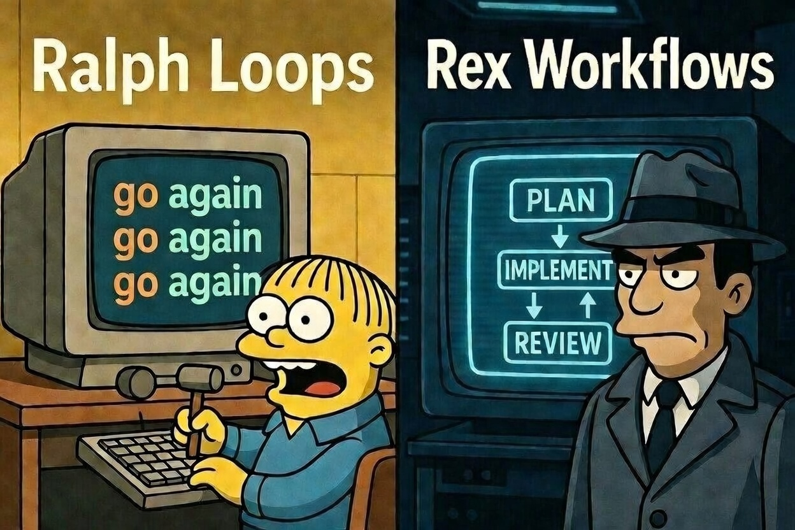
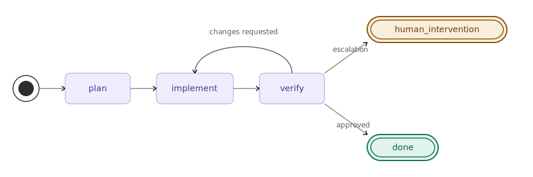

# Ralph Meets Rex



Define multi-step coding workflows that match how you actually work. `rmr` orchestrates AI agents through YAML-defined state machines — plan, implement, review, loop — so you can encode your process once and run it on any task.

## Quick Start

```bash
npm install -g @klaudworks/rmr@latest        # install or update
rmr install feature-dev                       # add the feature-dev workflow
rmr run .rmr/workflows/feature-dev/workflow.yaml --task "Implement feature X"  # run it
```

## Sample Workflows

### [feature-dev](docs/workflows/feature-dev/)

Plan, implement, and review a single feature end-to-end — with an automatic revision loop.

<p align="center">
  
</p>

```bash
rmr install feature-dev
rmr run .rmr/workflows/feature-dev/workflow.yaml --task "Add rate limiting to the API"
```

## Supported Harnesses

| Harness | |
|---------|:---:|
| [Claude Code](https://claude.ai/code) | :white_check_mark: |
| [Codex](https://openai.com/index/codex/) | :x: |
| [OpenCode](https://opencode.ai) | :x: |

## Commands

| Command                       | Description                                    |
| ----------------------------- | ---------------------------------------------- |
| `rmr install <workflow>`      | Copy a bundled workflow into `.rmr/workflows/` |
| `rmr run <path> --task "..."` | Start a new workflow run                       |
| `rmr continue <run-id>`       | Resume a paused or interrupted run             |
| `rmr completion <shell>`      | Print shell completion script                  |
