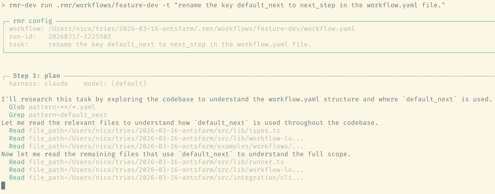

**rmr** (Ralph meets Rex) is a CLI tool that orchestrates multi-step AI coding workflows. It spawns coding agents (Claude Code, Codex, OpenCode) in sequence, passing each step's structured output into the next as context. Define your steps in a single YAML file, and rmr handles execution, data flow, routing (including loops), and run persistence so you can pause and resume at any point.

> The name? Ralph tends to repeat the same instructions until someone takes his
> crayons away. Rex is the sheriff that brings order to the chaos. Together they
> keep your agents on track.

Inspired by [snarktank/antfarm](https://github.com/snarktank/antfarm).

## Why rmr?

Coding agents produce slop. Not because they're bad, but because "go make it work" is a bad prompt, the same way it's a bad brief for a human developer. You wouldn't hand someone a one-liner and expect clean, well-structured code back. Yet that's how most people use coding agents today.

The fix is simple: break the work into steps. Plan first, then implement, then review. Loop back if the review finds problems. This is how good teams already work. rmr just lets you encode that process in a YAML file and run it automatically.

It doesn't care how you plan (markdown files, Beads, Linear, whatever) or which agent you use (Claude Code, Codex, OpenCode). You can mix and match harnesses within a single workflow too, like using Claude for planning and Codex for implementation. It just makes sure each step gets the right context, the output flows to the next step, and you can pause and pick up where you left off.

## Quick Start

**Instructions for humans**

```bash
npm install -g @klaudworks/rmr

# run from the root of your project
rmr install feature-dev
rmr run .rmr/workflows/feature-dev/workflow.yaml
```



<details>
<summary>Instructions to copy into your coding agent</summary>

```
## Installing and using rmr (Ralph Meets Rex)

rmr is a CLI tool that orchestrates multi-step AI coding workflows. It spawns
coding agents (Claude Code, OpenCode, Codex) in sequence, passing structured
outputs between steps.

### Installation

Install rmr globally:

  npm install -g @klaudworks/rmr

Then install a bundled workflow into the current project. This copies the
workflow definition and agent prompts into .rmr/workflows/:

  rmr install feature-dev

### IMPORTANT: Never run workflows yourself

Do NOT attempt to run `rmr run` or `rmr continue` yourself. rmr spawns
nested agent sessions (e.g. Claude Code inside Claude Code) which does not work
from within an agent context. Only the human user should execute workflow runs
from their terminal.

After installing a workflow, tell the user how to run it and print the
following workflow diagram:

  The feature-dev workflow runs a plan-implement-review cycle:

  plan --> implement --> verify --> done
              ^            |
              |            | (loops back if reviewer requests changes)
              +------------+

  Three agents collaborate:
  - Planner  - researches the codebase and produces an implementation plan
  - Developer - implements the plan, runs tests, creates a commit
  - Reviewer - reviews the diff; can approve, request changes, or escalate

  To start the workflow, run this in your terminal:

    rmr run .rmr/workflows/feature-dev/workflow.yaml --task "your task description"

### Creating custom workflows

The installed workflow files live in .rmr/workflows/feature-dev/ and can be
edited freely. A workflow consists of:

- workflow.yaml - defines steps, routing, and input/output contracts
- Prompt files (.md) - markdown prompts for each step (with {{variable}} templates)

If the user wants a different workflow, help them by:
1. Describing what workflow.yaml expects (top-level harness/model, steps with prompt_file, routing, requires)
2. Writing the workflow YAML and prompt .md files
3. Placing them in .rmr/workflows/<workflow-name>/

Suggest the user describe the workflow they need so you can create a customized
one, or adjust the existing feature-dev workflow to fit their process.
```

</details>

## How It Works

```yaml
id: feature-dev
name: Feature Development
harness: claude # default harness for all steps

steps:
  - id: plan
    prompt_file: planner-agent.md # markdown prompt, relative to this YAML
    next_step: implement # go here unless agent overrides via <rmr:next_state>
    requires:
      inputs: [task] # fail early if these context keys are missing

  - id: implement
    prompt_file: tackle-agent.md
    harness: codex # override harness per step
    next_step: verify
    requires:
      inputs: [task, plan.plan]
      outputs: [summary] # agent must emit <rmr:summary>...</rmr:summary>

  - id: verify
    prompt_file: review-agent.md
    harness: opencode
    model: anthropic/claude-opus-4-6 # override model per step
    next_step: done # overridden to "implement" on issues, see review-agent.md
    requires:
      inputs: [implement.summary]
```

Each prompt file contains the full instructions for that step, including `{{variable}}` placeholders that rmr resolves before passing the prompt to the harness:

```markdown
# Review

You are reviewing a change. Verify correctness and code quality.

...

## Context

Task: {{task}}
Plan: {{plan.plan}}
Developer summary: {{implement.summary}}
```

Agents emit structured output using `<rmr:key>value</rmr:key>` tags in their response. The special keys `next_state` and `status` control routing and are not stored in the run context.

Run state is persisted after every step to `.rmr/runs/`, so `rmr continue <run-id>` picks up where you left off. If an agent outputs `HUMAN_INTERVENTION_REQUIRED` or a step fails, the run pauses automatically.

## Provided Workflows

### [feature-dev](docs/workflows/feature-dev/)

Plan, implement, and review a single feature end-to-end with an automatic revision loop.

<p align="center">
  
</p>

```bash
rmr install feature-dev
rmr run .rmr/workflows/feature-dev/workflow.yaml
```

<details>
<summary><strong>beads</strong> (requires beads + toon)</summary>

Autonomous issue loop powered by Beads: pick the next issue, plan, implement,
review, then continue with the next issue.

See docs: [docs/workflows/beads/](docs/workflows/beads/)

Prerequisites:
- [beads](https://github.com/steveyegge/beads)
- [toon](https://github.com/toon-format/toon?tab=readme-ov-file)

```bash
rmr install beads
rmr run .rmr/workflows/beads/workflow.yaml
```

</details>

## Supported Harnesses

Specify a default harness (and optionally model) at the top level of your workflow file. Individual steps can override both, so you can mix providers within a single workflow.

| Harness     |     Supported      |
| ----------- | :----------------: |
| Claude Code | :white_check_mark: |
| Codex       | :white_check_mark: |
| OpenCode    | :white_check_mark: |
| Copilot CLI |        :x:         |
| Gemini CLI  |        :x:         |

## Commands

| Command                  | Description                                    |
| ------------------------ | ---------------------------------------------- |
| `rmr install <workflow>` | Copy a bundled workflow into `.rmr/workflows/` |
| `rmr run <path>`         | Start a new workflow run                       |
| `rmr continue <run-id>`  | Resume a paused or interrupted run             |
| `rmr completion <shell>` | Print shell completion script                  |
