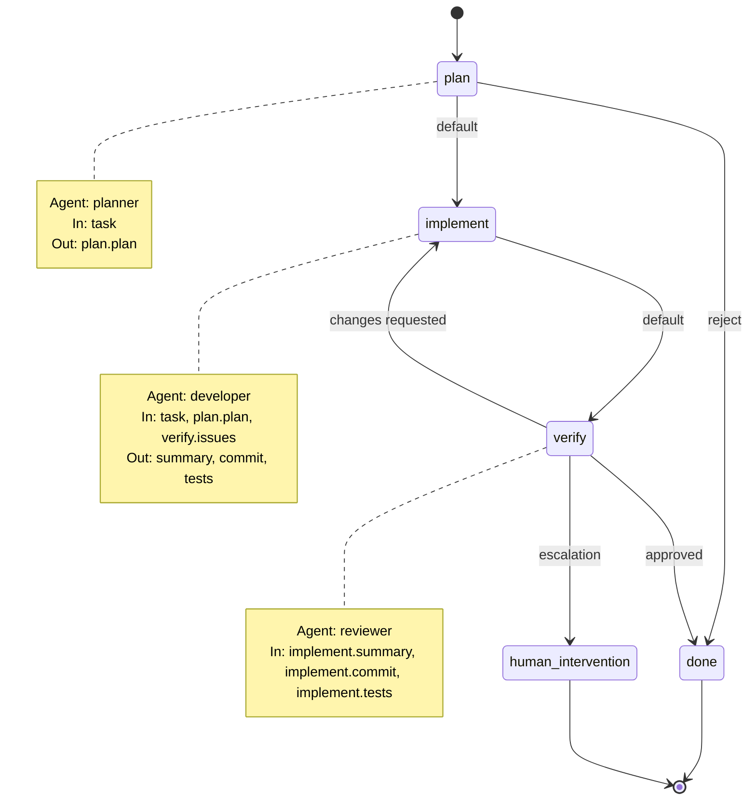
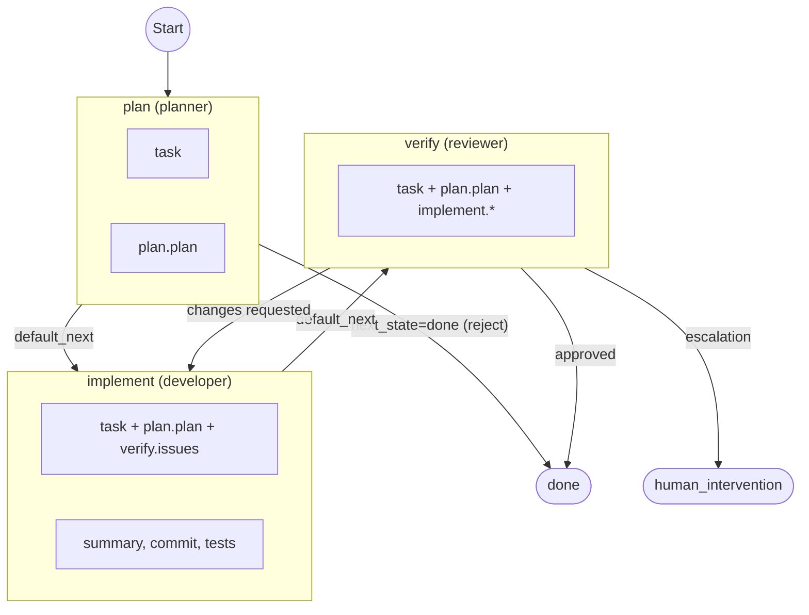

# Workflows

Workflows are installed into project-local `.rex/workflows/` folders.

Each workflow lives in its own directory and keeps agent prompts next to the workflow definition:

```text
.rex/
  workflows/
    feature-dev/
      workflow.yaml
      planner-agent.md
      tackle-agent.md
      review-agent.md
```

## Install a bundled workflow

Use the CLI command below to copy a workflow from the bundled `examples/workflows/`
catalog (shipped from this repo) into your local `.rex/` folder.
If `.rex/` or `.rex/workflows/` does not exist yet, `rex install` creates it.

```bash
rex install feature-dev
```

Then run it:

```bash
rex run .rex/workflows/feature-dev/workflow.yaml --task "Implement feature X"
```

## Prompt file resolution

Agent `prompt` paths are resolved relative to the workflow file directory.

Example from `workflow.yaml`:

```yaml
agents:
  - id: planner
    provider: claude
    prompt: planner-agent.md
```

That resolves to:

```text
.rex/workflows/feature-dev/planner-agent.md
```

## feature-dev workflow

Three agents — planner, developer, reviewer — run in sequence with a review loop.

### State diagram



### Flowchart



### Steps

| Step | Agent | Required input | Outputs | Default next |
|------|-------|---------------|---------|-------------|
| `plan` | planner | `task` | `plan.plan` | `implement` |
| `implement` | developer | `task`, `plan.plan` | `summary`, `commit`, `tests` | `verify` |
| `verify` | reviewer | `implement.summary` | — | `done` |

The core iteration loop is `implement` → `verify` → `implement`. On each loop, reviewer issues (`verify.issues`) are fed back into the developer prompt as reviewer feedback.
